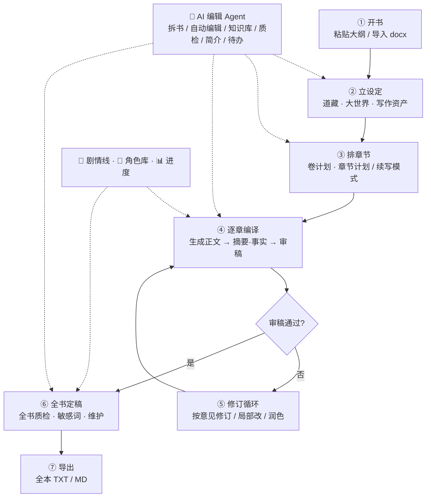
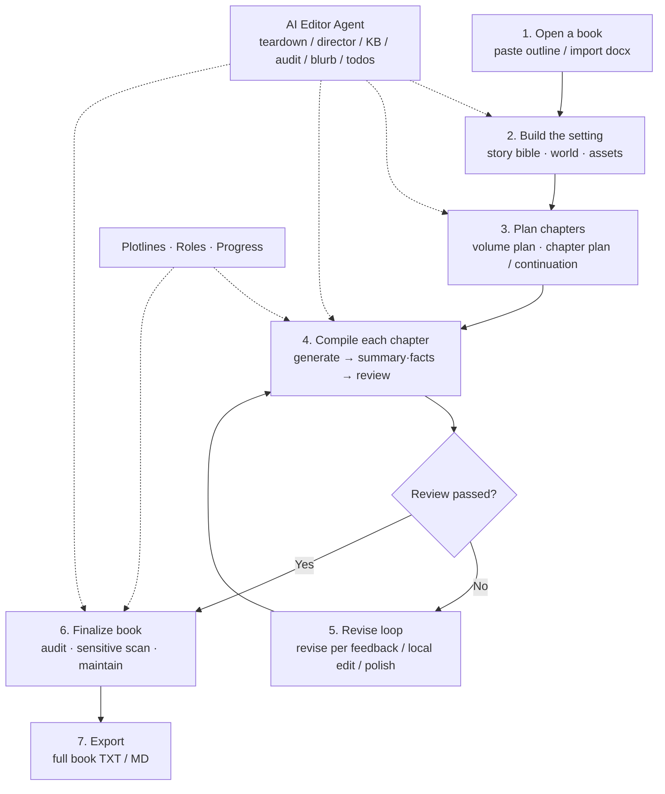

# dsh-novel-forge — AI 编译小说工作台 / AI Novel Writing Workbench

**中文** | [English](#english)

你的专属 AI 小说写作插件：把一份大纲"编译"成一本完整的小说。
Your personal AI novel-writing plugin for DSH: turn an outline into a complete novel.

> **⚠️ 版本状态 / Version status（read this first）**
>
> - 本插件当前**唯一发布 / 更新线为 V2.0 ALPHA（`2.1.2-alpha`）**，适用于 **DSH ≥ 0.1.3-alpha.1**（依赖 DSH 提供的 `cosmokit`，不能在纯 Node 环境单独运行）。
> - **V1.0 RC（`1.10.1`）为最终稳定版，已停止更新**；需要稳定版请显式安装 `@waterwx/dsh-novel-forge@1.10.1`。
> - **安装前请确认你的 DSH 版本**：在 `0.1.3-alpha.1` 以前的 DSH 上安装 V2.0 ALPHA 会加载失败。
> - npm `latest` 现指向 V2.0 ALPHA：`npm i @waterwx/dsh-novel-forge` 会安装预发布版；想要最终稳定 RC 请用 `@1.10.1`。

<p align="center">
  
  
  <a href="https://github.com/watersxya/dsh-novel-forge/actions"></a>
</p>

<p align="center">
  
  
  
  
  
  
  
  
</p>

---

## 功能一览 / Features

| 中文 | English |
|---|---|
| **创作工作流仪表盘**：主行动卡（推荐下一步）+ 创作旅程进度条 + 状态条 + 待办队列 + 资产健康 | **Workflow dashboard**: next-action hero card, journey progress bar, status strip, todo queue, asset health |
| **书架首页**：书卡网格（封面/简介/进度）+ 开书向导独立页，进入工坊先选书 | **Bookshelf home**: book card grid with covers, blurbs and progress, plus a dedicated book-wizard page |
| **正文编辑 + AI 审查 + 保存**：章节工作区直接改文，审查草稿不落盘，保存即审稿（沿用报告不重复审） | **Edit → AI check → save**: edit chapter text, review the draft without persisting, save-with-review reuses the report |
| **按意见修订**：审稿未通过时一键按意见自动修订（指令自动预填 high 优先问题） | **Revise by review**: one click to revise with the review feedback pre-filled |
| **国风模块**：总纲 / 道藏 / 大世界 / 人物志 / 暗线 / 编年录 / 文戒 / 笔法帖 / 心法 | **Wuxia-flavored modules**: outline, story bible, world, characters, foreshadows, fact ledger, anti-AI rules, style templates, custom style |
| **规模化加固**：上下文分片、相关事实注入、质检/影响分析分批、status 瘦身、按卷折叠、token 优化（摘要+事实合并省 25%） | **Scale hardening**: sharded contexts, related-fact injection, batched audit/impact, slim status, volume folding, token optimizations |
| **开书向导**：书架新建书时直接导入大纲（docx/粘贴），开书即建项目，书名自动识别 | **Book wizard**: create a book with its outline in one step — project is built immediately |
| **大纲只读化**：开书后大纲页只读展示；「更新大纲」可选仅改文本（保留进度）或重置项目重来 | **Read-only outline**: after opening a book the outline is read-only; update offers keep-progress or full reset |
| **章节计划结构化**：每章含 本章目标 / 剧情要点 / 爽点·钩子 / 结尾钩子 | **Structured chapter beats**: goal / plot points / payoff-hook / ending hook per chapter |
| **章节计划续写模式**：已有章节时自动续写规划（上一章结尾原文 + 编年录锚点 + 已发生情节禁令），不再重头生成；追加自动去重 | **Continuation planning**: with existing chapters the planner continues from the last chapter's ending (tail text + fact anchors + banned-repeat list), never restarts; duplicate titles are dropped on append |
| **事实库 / 时间线**：每章自动抽取已确立事实，注入后续生成，保证长期一致 | **Fact ledger**: auto-extracted per-chapter facts injected into later chapters for consistency |
| **全书一致性质检**：LLM 扫描全本，输出矛盾清单（定位到章），一键去修订 | **Book audit**: LLM scans all chapters for contradictions, locates them, one-click to revise |
| **角色卡**：出场统计精确计算 + LLM 聚合当前状态，历史章节可回填事实库 | **Character cards**: precise appearance stats + LLM-aggregated status; backfill for old chapters |
| **润色/修订工作区**：左栏原文（选中即局部修订）+ 右栏指令/预览/应用，草稿制不覆盖原稿，自动备份 .bak | **Revision workspace**: editable original + selection-targeted local edits, draft-apply flow with auto-backup |
| **章节编辑独立页**：点「编辑」进入独占整页（左导航保留），原文｜对比左右各半、原稿新稿并排高亮，默认即对比模式 | **Full-page chapter editor**: opening a chapter takes over the content pane; original vs draft side by side with highlighted changes, diff view by default |
| **审稿问题勾选修复**：审查报告每条问题可勾选，一键按所选问题修订（默认勾 high） | **Selective review fixes**: check any review issues (high pre-checked) and fix them in one click |
| **编辑器字号可调**：设置页 12-24px + 编辑页 A−/A＋ 快捷调整（localStorage 记忆） | **Adjustable editor font size**: 12-24px in settings plus A−/A＋ in the editor toolbar (localStorage) |
| **AI 助手悬浮窗**：可拖动、可拉大小、位置记忆；「编辑老师」全量知情 + 影响分析 + 步骤卡片 + 思考计时 + 清空聊天 | **Floating AI assistant**: draggable, resizable, position remembered; full-context "editor" persona with impact analysis and live step cards |
| **剧情线管理**：主线/支线/人物线/悬念线，目标与进度追踪、章节关联；生成时强制每章推进至少一条活跃线，工作台实时进度 | **Plotline management**: main/branch/character/mystery arcs with goals, progress and linked chapters; generation must advance an active arc, live progress on the workbench |
| **AI 剧情规划**：健康检查（是否需要新线/多少章后加/各线健康度）+ 一键设计剧情方案（下一阶段方向 + 建议新线可采纳）+ 单线 AI 刷新进度 | **AI plotline planning**: health check (need new arcs? when?) + one-click design plan (next-stage direction + adoptable arcs) + per-arc progress refresh |
| **角色库**：独立页签——AI 从全书提炼角色（自动分级主角/女主/女配/配角/反派/路人）、候选逐条采纳、定位/关系网/成长线/知情度编辑；生成时按定位规格刻画互动 | **Role library**: dedicated tab — AI extracts all characters with auto-tiering (protagonist/female lead/female support/support/antagonist/extra), adopt per candidate, edit identity/relations/arc/knowledge; generation follows the role tier |
| **人物志持久化**：角色当前状态（编年录聚合）落盘存档，打开即显示；状态卡带「查看档案」跳转角色库 | **Persistent character status**: aggregated status from the chronicle is saved to disk and shown on open; each card links to the role library |
| **作者复盘**：每章自动复盘（钩子兑现/结尾钩子强度/剧情线推进/连续性/节奏趋势），按卷分组的复盘记录页，复盘自动关联推进的剧情线 | **Author review**: per-chapter structural review (hook payoff / ending hook / arc progress / continuity / pacing), volume-grouped records page, auto-links advanced arcs |
| **工作进度悬浮窗**：工具组入口，可拖拽/缩放/位置记忆；当前任务大进度条 + 全量活动记录，任务开始自动弹出 | **Floating progress console**: draggable/resizable window from the tools nav with live task progress bar + full activity log, auto-opens on task start |
| **角色知情度**：每个角色"已知信息"清单，生成与审稿严格维护信息差（未列出的信息角色一律不知道） | **Character knowledge**: per-character known-info lists; writing & review enforce information asymmetry strictly |
| **助手写操作守卫**：AI 助手只在作者明确指令下执行写操作（生成/修订/删除），随口提问不会误触发生成章节 | **Assistant write guard**: the AI assistant only performs write actions (generate/revise/delete) on explicit author instruction — casual questions can never trigger chapter generation |
| **相关事实全量检索**：生成时按本章剧情要点对全量编年录检索（角色名加权 + 近因加权 + 去重），长篇连载旧设定不因窗口滑出而丢失 | **Full-ledger fact retrieval**: chapter generation retrieves relevant facts across the entire chronicle (character-name + recency weighting, dedup) — old settings survive in long serials |
| **并发安全保存**：计划/生成/审稿落盘前自动合并磁盘最新设定（道藏/角色库/剧情线/知情度），多窗口操作互不覆盖 | **Concurrency-safe saves**: plan/generate/review merge the latest on-disk settings (bible/roles/plotlines/knowledge) before saving — parallel windows never clobber each other |
| **敏感词检查**：内置违禁词库（政治/擦边/暴力/辱骂/广告）全书一键扫描，命中定位到章并一键去修订 | **Sensitive-word check**: built-in banned-word library scans all chapters, hits located per chapter with one-click fix |
| **编年录独立页**：事实库从设置页移入数据库导航，支持一键回填历史章节 | **Chronicle tab**: the fact ledger moved into the database nav with one-click backfill |
| **三套主题**：iOS 液态玻璃（绿）/ 经典毛玻璃（蓝）/ 新拟物双阴影，设置页即时切换（localStorage） | **Three themes**: iOS Liquid Glass (green) / classic frosted (blue) / neumorphism, instant switching in settings |
| **活动输出控制台**：工作流页实时记录生成/审稿/润色/质检等全部活动，自动滚动 + 一键清空 | **Activity console**: dashboard records every action (writing/review/polish/audit), auto-scrolls, one-click clear |
| **iOS 字体统一**：SF Pro + 苹方/冬青黑体/微软雅黑全站统一，编辑区不再等宽 | **iOS font stack**: SF Pro + PingFang/Hiragino/YaHei unified across the panel; editor no longer monospace |
| **分组导航 + 状态角标**：创作/工具/数据库分组，章节待办/伏笔/进度角标 | **Grouped nav + badges**: creation/tools/database groups with live badges |
| **iOS 风格毛玻璃 UI**（浅色/深色） | **iOS-style frosted glass UI** (light/dark) |
| **书架 / 伏笔管理 / 写作资产（题材·推进·写法·反AI规则·自定义引擎）/ 全本导出（TXT/MD）/ 卷首语与封面** | **Bookshelf / foreshadowing / writing assets / full-book export (TXT/MD) / blurb & cover** |
| **角色形象（🖼️）**：角色详情悬浮页=提示词分发中心——立绘/四视图/表情×N/细节 四类生图提示词（中文默认+英文标签折叠），一次提炼直接产出锚点+表情清单+精修提示词包，图集（立绘/四视图/表情/场景/细节）分类上传 | **Character visuals**: role detail modal as prompt hub — portrait / 4-view / expressions / details prompt kits (CN default + EN tags folded), one-shot extraction yields anchor + expression list + refined kits, gallery uploads by category |
| **场景库（🏞️）**：从全书提炼「镜头场景」级视觉锚点（五幕结构/时间光态/关键镜头/人物状态），中英文生图提示词 + 场景图集，候选逐条采纳 | **Scene library**: shot-level visual anchors extracted from the book (act structure / time-of-day / key beats / character state), CN+EN prompts, adoptable candidates |
| **视觉世界观规则（⚠️）**：从道藏提炼生图纠偏规则（如"货架商品=活人，禁止画成常规超市商品"），自动注入所有角色/场景提示词——反常识设定的书不再被生图模型画跑偏 | **Visual world rules**: extraction-time guardrails from the story bible (e.g. "shelf items are living people, no cans/bottles"), auto-injected into every prompt — counter-intuitive settings render correctly |
| **漫剧工作台（V2.0 新增）**：创建方案（风格/滤镜/题材）→ 一键生成（拆剧情→分镜→提名角色→视频提示词）→ 分镜工作台（骨架/分镜表/提示词）→ 角色定妆 → 场景底图 → 导出即梦脚本 | **Manga Workbench (V2.0, new)**: create a plan (style/filter/genre) → one-click generate (skeleton→storyboard→role nominations→video prompts) → storyboard studio (skeleton/table/prompts) → character styling → scene base → export Jimeng scripts |

## 最近更新 / What's New（本次迭代）

本次迭代把「专业工作流」交给 **AI 编辑 Agent** 代办，并新增一批策划/灵感/编排能力：

- 💬 **AI 编辑 Agent**：书内助手改名并升级，一句话即可代办——拆书、自动编辑、知识库（增/查/列）、剧情线、编辑待办、全书质检、简介、章节生成/审稿/修订、大纲/道藏/暗线/资产、导出；写操作有安全放行 + 收敛规则，不会循环或乱改。
- 📡 **题材雷达 → 灵感**：扫榜（番茄/起点/晋江）→ 题材信号 / 生产底座 / 开书简报 → 一键「用这些信号生成灵感」，得到贴合市场的多个开书方向。
- 🎬 **自动编辑**：基于本书分卷/剧情线/伏笔/事实，给出下一阶段节点、节奏板、风险与修复；可一键采纳为剧情线或待办。
- 📚 **知识库 / RAG**：书内自由参考文档，生成时按章节检索注入，提升一致性。
- 📊 **书分析 / 拆书**：输入任意文本 → 卖点 / 结构 / 可借鉴 / 风险。
- 💡 **创意灵感**：一句话/题材 → 多个差异化开书灵感，可「以此方向开书」。
- 🧭 **进阶工具折叠**：默认只露创作流水线 + 核心（助手 / AI 进度）+ 资产，进阶工具收进折叠组；创作页新增「问 AI 编辑 Agent」入口。
- 🃏 **结构化结果卡片**：拆书 / 自动编辑 / 质检 / 知识库列表等工具结果，在对话里直接渲染成卡片。


```sh
pnpm install        # 安装依赖 / install dependencies
pnpm build          # 重新构建 lib/ / rebuild lib/
```

挂载到 dsh web profile / Mount into the dsh web profile:

```sh
dsh plugin --profile web add link:"<此目录绝对路径>"
```

或 / or in `~/.dsh/profiles/web/cordis.patch.yml`:

```yaml
- insert:
    - id: novel-forge
      name: '@waterwx/dsh-novel-forge'
```

重启 dsh web 后，侧边栏出现「小说工坊」。
Restart dsh web and the "Novel Forge" entry appears in the sidebar.

## 安装方式 / Installation

### 从 GitHub 安装 / Install from GitHub

```sh
dsh plugin --profile web add github:watersxya/dsh-novel-forge
```

> 注意：pnpm ≥10 默认拒绝运行 git 依赖的 `prepare` 构建脚本。首次安装失败时，把 pnpm 提示的包键加入该 profile 的 `pnpm-workspace.yaml`：
> Note: pnpm ≥10 refuses to run `prepare` build scripts of git dependencies by default. On first failure, add the package key pnpm prints to the profile's `pnpm-workspace.yaml`:
>
> ```yaml
> allowBuilds:
>   '@waterwx/dsh-novel-forge': true
> ```
>
> 然后重新执行 `add`。只对源码可信的包授权。
> Then re-run `add`. Only allow packages whose source you trust.

### 从 npm 安装 / Install from npm（推荐 / recommended）

```sh
dsh plugin --profile web add @waterwx/dsh-novel-forge
```

npm 分发的是预构建产物，无需任何构建授权。
npm distribution ships prebuilt artifacts — no build authorization needed.

### 本地开发 / Local development

```sh
pnpm install && pnpm build
dsh plugin --profile web add link:"<本目录绝对路径>"
```

## 工作流程 / Workflow

一条主线：**开书 → 立设定 → 排章节 → 逐章编译 → 质检定稿 → 导出**。所有步骤都在侧边栏「小说工坊」面板内完成。



```
① 开书（书架 → 开书向导：粘贴大纲文本 / 导入 docx，书名自动识别）
   ↓
② 立设定（总纲只读 → ✨ 提炼道藏【人设/世界观/金手指规则/写作红线】→ 大世界【境界/区域/势力】→ 写作资产【题材/推进/笔法帖/文戒/心法】）
   ↓
③ 排章节（卷计划 → 章节计划：AI 按大纲生成每章 目标/剧情要点/爽点钩子/结尾钩子；
            已有章节时自动进入「续写模式」——读取上一章结尾原文 + 编年录锚点，不会重头生成）
   ↓
④ 逐章编译（生成正文 3000-4000 字 → 自动抽取摘要 + 编年录事实 → 自动 AI 审稿打分）
   ↓
⑤ 修订循环（审稿未过 → 按意见一键修订 / 工作区选中局部修改 / 润色去 AI 味 → 重审；
            不满意可「✔ 直接通过」行使作者终审权）
   ↓
⑥ 全书定稿（全书质检【矛盾清单】→ 敏感词扫描 → 编年录/剧情线/角色库/复盘定期维护）
   ↓
⑦ 导出（全本 TXT / MD，含卷首语与封面）
```

**辅助旁路（任意阶段可用）**：💬 AI 助手悬浮窗（问设定/改文/影响分析）、🧵 剧情线管理（健康检查/设计剧情方案）、👥 角色库（AI 提炼/知情度维护）、📊 工作进度悬浮窗（任务实时进度与活动记录）、书架多书切换。

**推荐节奏**：先让 ②③ 完整落地（设定越全，章节质量越高）；④ 建议逐章或小批生成，便于在 ⑤ 及时修正；长篇小说每写 20-30 章跑一次 ⑥ 全书质检，防止设定漂移。

## 目录结构 / Directory Layout

```
src/            插件源码（宿主半 + 浏览器半）/ plugin source (host + browser)
lib/            构建产物（lib/index.js 宿主 / lib/client.js 浏览器）/ build output
scripts/        工具脚本 / utility scripts
package.json    包定义（dsh.bundle.patch + dsh.client 声明）/ package definition
cordis.patch.yml  profile 挂载补丁 / profile mount patch
tsdown.config.ts  双面打包配置 / dual-face bundling config
```

## 数据位置 / Data Locations

- 书架 / Bookshelf：`~/.dsh/dsh-novel-forge-bookshelf.json`
- 每本书一个输出目录（含 `novel-project.json` + 各章 Markdown + 润色备份 `.bak.md`）/ each book owns an output directory
- AI 助手对话记录 / assistant log：`<输出目录>/novel-assistant.jsonl`

## 相关影响 / Impact & Notes

使用本插件会对你的账号、磁盘与 LLM 额度产生以下影响，请知悉：

- **LLM 额度消耗**：生成/审稿/润色/质检/提炼/复盘等所有 AI 操作都调用 LLM（默认 `deepseek-official / deepseek-v4-flash`）。量级参考：一章 3000-4000 字正文 ≈ 1-2 万 token（含推理）；审稿约 2000-3000 token；全书质检与角色提炼更贵（数万 token）。批量操作（如一次生成多章、全书质检、复盘补齐）会连续消耗额度，建议分小批执行。
- **写操作守卫**：AI 助手只在作者**明确要求**时执行写操作（生成/修订/删除章节、改设定等）。你只是提问、查信息时，助手只会回答、不会擅自改文——防止"随口一问"误触发生成。
- **并发安全**：计划/生成/审稿落盘前会自动合并磁盘上的最新设定（道藏/角色库/剧情线/知情度），多窗口同时操作不会互相覆盖。
- **数据落盘**：每本书一个输出目录（默认 `~/.dsh/novels/<书名>`，可在设置页修改），正文为 Markdown 文件、项目状态为 `novel-project.json`、助手对话为 `novel-assistant.jsonl`；润色/重写应用草稿前自动生成 `.bak.md` 备份原稿。
- **设置持久化**：面板「设置」页的修改（输出目录/模型/审稿阈值等）写入 `~/.dsh/settings.yaml` 的 `dsh-novel-forge` 段；界面偏好（主题/字号/面板宽度）存在浏览器 localStorage。
- **token 优化**：生成与审稿已做上下文分片、相关事实注入与摘要合并，长篇连载下批量成本约省 25%，但单章仍受模型上下文窗口限制（超长设定会按需检索注入，而非全量塞入）。

## 限制 / Limitations

- 生成消耗 LLM API 额度（默认 deepseek-official / deepseek-v4-flash）/ generation consumes LLM API quota
- 章节质量取决于大纲完整度 / chapter quality depends on outline completeness
- 设置写入 `~/.dsh/settings.yaml` 的 `dsh-novel-forge` 段 / settings persist in `~/.dsh/settings.yaml`
- 角色/场景视觉资产为「提示词 + 图集」形态，并可在设置页配置内置生图模型（imageModels/imageApiKey，支持多模型库与连通性测试）；出图既可走内置生成，也可用外部工具（即梦/豆包/Krea 等），提示词可直接复制 / visual assets are prompt+image anchors, with optional built-in image-model configuration (imageModels/imageApiKey, multi-model library + endpoint test); images may be generated in-app or via external tools (Jimeng/Doubao/Krea) with copy-ready prompts
- **V2.0 ALPHA** 新增并重做「漫剧工作台」：创建方案 → 一键生成 → 分镜工作台（骨架/分镜表/视频提示词）→ 角色定妆 → 场景底图 → 导出即梦脚本；仅适用于 **DSH ≥ 0.1.3-alpha.1**（依赖 DSH 的 `cosmokit`）。V1.0 RC（`1.10.1`）不含此功能且已停止更新 / **V2.0 ALPHA** adds the reworked Manga Workbench (create plan → one-click generate → storyboard studio → character styling → scene base → export Jimeng scripts); requires **DSH ≥ 0.1.3-alpha.1** (relies on DSH's `cosmokit`). V1.0 RC (1.10.1) lacks it and is no longer updated.

---

<a id="english"></a>

## English

# My Personal AI Novel Forge

This is the working copy of the `dsh-novel-forge` plugin. All
source code, build artifacts, and configuration are included — install, build,
and mount it any time.

## Feature Overview

- **Workflow dashboard**: next-action hero card with a reason, a 6-stage journey
  progress bar, a status strip, a todo queue, and asset health
- **Bookshelf home**: book card grid with covers, blurbs and progress; a
  dedicated book-wizard page opens a new book with its outline in one step
- **Edit → AI check → save**: edit chapter text in the workspace, review the
  draft without persisting, and save-with-review reuses the report (never
  double-review); one-click "revise by review" pre-fills the feedback
- **Wuxia-flavored modules**: 总纲 (outline), 道藏 (story bible), 大世界 (world),
  人物志 (characters), 暗线 (foreshadows), 编年录 (fact ledger), 文戒 (anti-AI
  rules), 笔法帖 (style templates), 心法 (custom style)
- **Read-only outline**: after opening a book the outline page is read-only;
  "Update outline" offers either keep-progress text update or full project reset
- **Structured chapter beats**: every planned chapter carries goal / plot points /
  payoff-hook / ending hook sections
- **Continuation planning**: with existing chapters the planner continues from the
  last chapter's ending — it injects the previous chapter's tail text, fact-ledger
  anchors and a banned-repeat list (e.g. no re-entering the xu-jing), and trims the
  outline to settings-only, so regenerating a plan never restarts the story;
  duplicate titles are dropped on append
- **Fact ledger**: each chapter auto-extracts established facts (character state,
  resources, relations, foreshadow landings); the latest 20 are injected into
  later chapters to keep the long story consistent
- **Book audit**: one click scans all written chapters against the bible, fact
  ledger and red lines, reporting located contradictions with one-click revision
- **Character cards**: appearance statistics are computed precisely from the
  chapter bodies, status is LLM-aggregated; historical chapters can be backfilled
- **Revision workspace**: editable original on the left (select text for
  targeted local edits), instruction + preview + apply/cancel on the right;
  drafts never overwrite until applied, and applying auto-backs-up the original
- **Full-page chapter editor**: clicking "Edit" takes over the content pane
  (left nav stays); original vs draft side by side 1:1 with highlighted
  changes, diff view on by default
- **Selective review fixes**: every review issue gets a checkbox (high issues
  pre-checked) and one click fixes exactly the checked ones
- **Adjustable editor font size**: 12-24px in settings plus A−/A＋ shortcuts in
  the editor toolbar, remembered in localStorage
- **Floating AI assistant**: draggable, resizable, position-remembered dialog
  with a full-context "editor" persona, impact analysis, live step cards and
  conversation clearing
- **Grouped navigation with live badges**: creation / tools / database groups,
  badges for chapter todos, foreshadows and journey progress
- **Scale hardening**: sharded book contexts, related-fact injection, batched
  audit/impact analysis, slim status payload, volume folding and token
  optimizations (summary+facts merged into one call, ~25% cheaper batches)
- **iOS-style frosted glass UI** with light & dark palettes
- Bookshelf, foreshadowing management, writing assets (genre / progression /
  style templates / anti-AI rules / custom style engine), full-book export,
  blurb & cover

## What's New

This iteration hands the professional workflows over to the **AI Editor Agent**
and adds a batch of planning / inspiration / orchestration capabilities:

- 💬 **AI Editor Agent**: the in-book assistant renamed & upgraded — say one line
  and it handles 拆书 (book teardown), 自动编辑 (auto-director), knowledge base
  (add/search/list), plotlines, director todos, book audit, blurb, chapter
  generate/review/revise, outline/bible/foreshadow/assets, export; write actions
  are gated and convergence-guarded so it never loops or edits on its own.
- 📡 **Market radar → inspiration**: scan public leaderboards (Fanqie / Qidian /
  Jinjiang) → signals / production foundation / creative brief → one-click
  "generate inspiration from these signals" for market-fit book ideas.
- 🎬 **Auto-director**: from this book's volumes / plotlines / foreshadows / facts,
  outputs next-arc nodes, pacing board, risks and fixes; adoptable into plotlines
  or todos in one click.
- 📚 **Knowledge base / RAG**: free-form reference docs per book, retrieved and
  injected per chapter at generation time for consistency.
- 📊 **Book analysis / teardown**: paste any text → selling points / structure /
  lessons / risks.
- 💡 **Creative inspiration**: one idea/genre → several differentiated book ideas,
  with "start a book this way".
- 🧭 **Advanced tools folded**: by default only the pipeline + core (assistant /
  AI progress) + assets are shown; advanced tools collapse into a group, and the
  dashboard gains a "Ask the AI Editor Agent" entry.
- 🃏 **Structured result cards**: tool results (teardown / director / audit /
  knowledge list) render as cards right in the conversation.

## Getting Started

```sh
pnpm install        # install dependencies
pnpm build          # rebuild lib/
```

Mount into the dsh web profile:

```sh
dsh plugin --profile web add link:"<absolute path to this directory>"
```

Or insert into `~/.dsh/profiles/web/cordis.patch.yml`:

```yaml
- insert:
    - id: novel-forge
      name: '@waterwx/dsh-novel-forge'
```

Restart dsh web, and the "Novel Forge" entry appears in the sidebar.

## Workflow

One main pipeline — **open a book → build the setting → plan chapters →
compile chapter by chapter → audit & finalize → export**. Everything happens
inside the "Novel Forge" panel in the sidebar.



```
① Open a book (bookshelf → book wizard: paste outline text / import docx; book name auto-detected)
   ↓
② Build the setting (read-only outline → ✨ extract story bible [characters/world/golden-finger rules/
   red lines] → world [realms/regions/factions] → writing assets [genre/progression/templates/rules/style])
   ↓
③ Plan chapters (volume plan → chapter plan: AI generates goal / plot points / payoff hook / ending
   hook per chapter; with existing chapters it auto-enters "continuation mode" — reads the previous
   chapter's ending + fact anchors, never restarts from scratch)
   ↓
④ Compile chapter by chapter (generate 3000-4000 chars → auto extract summary + fact ledger → auto AI review)
   ↓
⑤ Revision loop (review failed → one-click revise per feedback / select-targeted local edits / polish
   to remove AI flavor → re-review; or use "✔ approve directly" as the author's final say)
   ↓
⑥ Book-wide finalization (book audit [contradiction list] → sensitive-word scan → periodic maintenance
   of chronicle/plotlines/role library/reviews)
   ↓
⑦ Export (full book as TXT / MD, with blurb & cover)
```

**Side paths (usable at any stage)**: 💬 floating AI assistant (ask about the
setting / revise text / impact analysis), 🧵 plotline management (health check /
design plans), 👥 role library (AI extraction / knowledge tracking), 📊 floating
progress console (live task progress & activity log), multi-book bookshelf.

**Suggested cadence**: fully land steps ②③ first (the richer the setting, the
better the chapters); generate step ④ one chapter or small batches at a time so
step ⑤ can correct early; run the step ⑥ book audit every 20-30 chapters on long
serials to prevent setting drift.

## Impact & Notes

Using this plugin has the following effects on your account, disk and LLM quota:

- **LLM quota consumption**: all AI operations (generate/review/polish/audit/
  extract/review-backfill) call the LLM (default `deepseek-official` /
  `deepseek-v4-flash`). Rough scale: one 3000-4000 char chapter ≈ 10-20k tokens
  including reasoning; a review ≈ 2-3k tokens; book-wide audit and role
  extraction are more expensive (tens of thousands of tokens). Batch operations
  (multi-chapter generation, book audit, review backfill) consume quota
  continuously — prefer small batches.
- **Write guard**: the AI assistant only performs write actions (generate/revise/
  delete chapters, change settings) when the author explicitly asks. If you are
  just asking questions, it answers in prose and never modifies anything — casual
  questions can never trigger chapter generation.
- **Concurrency safety**: plan/generate/review merge the latest on-disk settings
  (bible/roles/plotlines/knowledge) before saving, so parallel windows never
  clobber each other.
- **Data on disk**: each book owns an output directory (default `~/.dsh/novels/<book name>`, configurable in settings)
  with per-chapter Markdown, `novel-project.json` project state, and
  `novel-assistant.jsonl` assistant log; applying polish/rewrite drafts auto-backs-up
  the original as `.bak.md`.
- **Settings persistence**: panel "Settings" changes (output dir/model/review
  threshold etc.) are written to the `dsh-novel-forge` section of
  `~/.dsh/settings.yaml`; UI preferences (theme/font size/panel width) live in
  browser localStorage.
- **Token optimization**: generation and review use sharded contexts, related-fact
  injection and merged summaries (~25% cheaper batches on long serials), but each
  chapter is still bounded by the model context window — long settings are
  retrieved on demand rather than injected in full.

## Directory Layout

```
src/             Plugin source (host half + browser half)
lib/             Build output (lib/index.js host / lib/client.js browser)
scripts/         Utility scripts
package.json     Package definition (dsh.bundle.patch + dsh.client declaration)
cordis.patch.yml Profile mount patch
tsdown.config.ts Dual-face bundling config
```

## Data Locations

- Bookshelf: `~/.dsh/dsh-novel-forge-bookshelf.json`
- Each book owns an output directory (containing `novel-project.json` project state,
  per-chapter Markdown, and polish backups `.bak.md`)
- AI assistant conversation log: `<output-dir>/novel-assistant.jsonl`

## Limitations

- Generation consumes LLM API quota (provider/model default: `deepseek-official` /
  `deepseek-v4-flash`)
- Chapter quality depends on outline completeness; batch generation is serial
- Settings (output directory, model, review threshold, etc.) are edited in the
  panel's "Settings" tab and written to the `dsh-novel-forge` section of
  `~/.dsh/settings.yaml`
