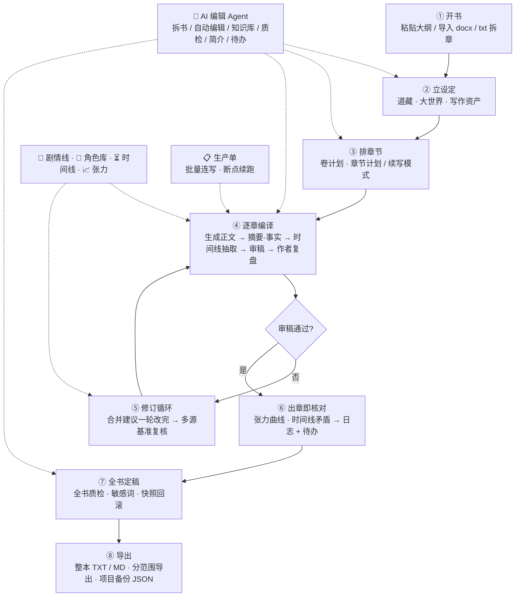

# dsh-novel-forge — AI 编译小说工作台 / AI Novel Writing Workbench

<p align="center">
  
  
  
  <a href="https://github.com/watersxya/dsh-novel-forge/actions/workflows/ci.yml"></a>
</p>

<p align="center">
  
  
  
  
  
  
  
  
</p>

你的专属 AI 小说写作插件：把一份大纲"编译"成一本完整的小说。

**版本：`1.3.0-alpha`** · 定位：**纯文本小说创作**。所有环节（开书、设定、规划、写作、审校、质检、导出）都在侧边栏「小说工坊」面板内完成；不涉及图片 / 视频 / 分镜生成。

> 整条线目前都是 `-alpha` 预发布：安装请显式带 `@alpha` 标签。
>
> **界面语言**：面板为**简体中文单语**（无语言切换）。本文档的中英对照是文档翻译，不代表界面提供英文。

---

## 功能一览 / Features

### 一、开书与设定 / Setup

| 中文 | English |
|---|---|
| **书架首页 + 开书向导**：书卡网格（封面 / 简介 / 进度），新建书一步导入大纲（docx / 粘贴 / txt 全本拆章），书名自动识别；另支持「想法 → AI 多方案大纲」 | **Bookshelf + book wizard**: card grid, one-step outline import (docx / paste / split from a full txt), auto book-name, idea → multi-option AI outline |
| **多书切换与导入**：书架登记多本书、切换即绑定；可导入已有项目目录或 txt/md 全本（拆章建项目） | **Multi-book**: register & switch books; import an existing project dir or a full txt/md (split into chapters) |
| **国风模块**：总纲 / 道藏 / 大世界 / 人物志 / 暗线 / 编年录 / 文戒 / 笔法帖 / 心法 | **Wuxia-flavored modules**: outline, story bible, world, characters, foreshadows, fact ledger, anti-AI rules, style templates, custom style |
| **道藏提炼**：从大纲与已写章节提炼人设 / 世界观 / 金手指规则 / 写作红线，注入生成与审稿 | **Story bible**: extract personas / world rules / golden-finger rules / red lines from outline & written chapters, injected into generation and review |
| **大世界**：境界体系 / 区域 / 势力结构化编辑 + AI 提炼，注入每章生成与审稿 | **World**: realms / regions / factions structured editing + AI extraction, injected per chapter |
| **写作资产**：题材基底 / 推进模式 / 笔法帖（叙事风格）/ 文戒（反 AI 规则）/ 心法（自定义文风），一键绑定本书 | **Writing assets**: genre base / progression modes / style templates / anti-AI rules / custom style, one-click binding |
| **题材雷达 → 灵感**：扫榜（番茄 / 起点 / 晋江）→ 题材信号 / 生产底座 / 开书简报 → 一键生成贴合市场的开书灵感 | **Market radar → inspiration**: scan public leaderboards → signals / production foundation / creative brief → market-fit book ideas |
| **创意灵感 / 书分析**：一句话或题材 → 多个差异化开书方向；粘贴任意文本 → 卖点 / 结构 / 可借鉴 / 风险 | **Inspiration / teardown**: one idea → several directions; paste any text → selling points / structure / lessons / risks |

### 二、规划与逐章写作 / Planning & writing

| 中文 | English |
|---|---|
| **卷计划 / 章节计划（结构化）**：每章含 本章目标 / 剧情要点 / 爽点·钩子 / 结尾钩子 / 必达项 / 必须保持项 / 人物硬事实 / 义务合约；**续写模式**自动读上一章结尾 + 编年录锚点 + 已发生情节禁令，不重头生成，重复标题自动去重 | **Volume / chapter planning (structured)**: goal / plot points / payoff-hook / ending hook / must-advance / must-preserve / character hard facts / obligation per chapter; **continuation mode** reads the previous ending + fact anchors + banned-repeat list |
| **逐章编译**：调用 LLM 生成 3000–4000 字正文并保存为 Markdown，流式输出实时进度 | **Chapter-by-chapter compile**: LLM writes 3000–4000-char bodies to Markdown with live stream |
| **提示词槽位**：文风补充 / 反 AI 补充 / 对话补充 / 章末钩子偏好四个**安全**槽位（各带字符上限，超长显式声明截断），随项目保存并注入写作提示词；与道藏、写作红线、合规红线冲突时一律以后者为准 | **Prompt slots**: four *safe* slots (style / anti-AI / dialogue / ending-hook) with per-slot caps and explicit truncation; injected into the writing prompt, always subordinate to bible, red lines and compliance |
| **局部改写**：选中任意段落只改这一段；整章重写；去 AI 味润色（对比后采纳） | **Targeted edits**: rewrite just the selected paragraph, whole-chapter rewrite, de-AI polish with diff-then-adopt |
| **作者复盘**：每章结构复盘（钩子兑现 / 结尾钩子 / 剧情线推进 / 连续性 / 节奏趋势），按卷分组，自动关联推进的剧情线，结果回灌编年录 | **Author review**: per-chapter structural review (hook payoff / ending hook / arc progress / continuity / pacing), grouped by volume, fed back into the fact ledger |

### 三、审稿与修订 / Review & revision

| 中文 | English |
|---|---|
| **自动 AI 审稿**：人设 / 设定 / 红线 / 文笔 / 节奏·爽点 / 逻辑 / 反 AI / 呈现 / 合规 九维打分，输出可勾选问题清单与建议 | **AI review**: 9-dimension scoring with a checkable issue list and suggestions |
| **修订循环**：审稿未过 → 按意见一键修订 / 选中局部改 / 去 AI 味润色 → 重审；「✔ 直接通过」行使作者终审权 | **Revise loop**: revise by review / targeted edits / de-AI polish → re-review; or approve directly |
| **审稿问题勾选修复**：每条问题可勾选（high 默认选），一键按所选问题修订 | **Selective review fixes**: check any issues (high pre-checked) and fix in one click |
| **修订仲裁（同一章只改一轮）**：审稿意见 + 时间线矛盾 + 张力偏差合并成**一份**指令；固定优先级 `审稿 high > 时间线 high > 张力 medium > 其它 > 审稿 low`；同源去重（标注「合并同类 N 条」）、单轮最多 8 条（截断显式声明）、每章最多 2 轮后转人工待办 | **Revision arbitration**: review issues + timeline conflicts + tension deviations merged into **ONE** instruction per chapter; fixed priority; same-source dedup; 8-item cap with explicit truncation; 2 rounds max then to manual todos |
| **张力 / 时间线默认只提示不阻塞**：出章即核对曲线 → 运行日志 + 建议性待办；**不单独触发修订**，只在因审稿 high 修订时搭同一轮车 —— 因此不增加轮次，也不会「改完甲又违反乙」 | **Tension/timeline are advisory-only**: checked on chapter completion → run log + advisory todos; never trigger a revision on their own, only ride along with a review-driven round |
| **验证基准是多源的**：修订后的复核不再只核对审稿意见，而是核对**本轮实际下发的全部条目**（时间线 / 张力条目带 `[时间线]` / `[张力]` 前缀），杜绝「复核说已解决、时间线说没改」 | **Multi-source verification baseline**: post-revision re-review checks every item actually issued this round (timeline/tension items carry source prefixes) |

### 四、长篇一致性 / Long-form consistency

| 中文 | English |
|---|---|
| **摘要 + 编年录事实库**：每章自动抽取剧情摘要与已确立事实（人物状态 / 资源 / 关系 / 线索落地），注入后续章节 | **Summary + fact ledger**: per-chapter summary & extracted facts injected into later chapters |
| **相关事实全量检索**：生成时按本章剧情要点对全量编年录检索（角色名加权 + 近因加权 + 去重），旧设定不因窗口滑出而丢失 | **Full-ledger retrieval**: plot-based retrieval across the whole ledger (character + recency weighting, dedup) |
| **故事时间线**：出章自动抽取「故事内时间 + 地点 + 在场角色 + 事件」，写作 / 修订提示词注入**本章之前**的锚点（最近 12 条，超出带显式截断声明）；规则初筛抓同章顺序自相矛盾、跨章**时间倒流**、**地点瞬移**，AI 复核补季节 / 年龄 / 回忆混淆；支持选章抽取、一键检查、就地修正（标记 manual）、一键按建议修订 | **Story timeline**: auto-extract story time / place / cast / event per chapter; inject anchors from *before* this chapter (last 12, explicit truncation); rule screening catches in-chapter order contradictions, time reversal, place jumps; AI review adds season/age/flashback confusion; extract, check, edit-in-place, one-click revise |
| **张力曲线**：逐章张力目标 + 审稿评分作为「实际值」；参考形状（递进爬升 / 悬疑加压 / 波浪呼吸 / 前紧后稳 / 平稳推进 + 自定义）；规则抓四类**曲线级**问题（偏差 >25 / 连续 4 章平台期 / 连续 3 章高位无呼吸 / 连续 5 章低位）；SVG 曲线（虚线参考 / 实线目标 / 绿点实际），点任意一章即可改目标 | **Tension curve**: per-chapter target + review-scored actual; reference shapes (escalation / suspense / wave / front-load / flat / custom); four curve-level rules; SVG chart, click any chapter to retarget |
| **剧情线与神秘线**：主线 / 支线 / 人物线 / 悬念线，目标与进度追踪、章节关联；生成强制至少推进一条活跃线；健康检查 + AI 剧情方案 | **Plotlines**: main / branch / character / mystery arcs with goals, progress & linked chapters; generation must advance a line; health check + AI plan |
| **角色库 + 人物志**：AI 从全书提炼角色并自动分级（主角 / 女主 / 女配 / 配角 / 反派 / 路人），候选逐条采纳；定位 / 关系网 / 成长线 / **知情度**严格维护信息差；人物志（当前状态聚合）落盘、可回填历史章节 | **Role library + chronicle**: AI extraction with auto-tiering, adopt per candidate; identity / relations / arc / knowledge asymmetry; persistent character status, backfillable |
| **暗线（伏笔）管理**：计划 / 已埋 / 已回收状态跟踪，章节绑定作者复盘自动标记埋设 | **Foreshadow threads**: planned / planted / resolved tracking, auto-marked on chapter review |
| **章节历史版本（快照）**：重新生成、采纳草稿前、助手直接修订前都会自动留存旧稿；每章默认保留 20 份；**回滚前先给当前稿留一份，所以回滚本身也可撤销** | **Chapter snapshots**: auto-saved before regenerate / draft-apply / assistant rewrite; 20 kept per chapter; rollback itself is undoable |

### 五、质检定稿与导出 / Audit, finalize & export

| 中文 | English |
|---|---|
| **全书一致性质检**：LLM 扫描全本输出矛盾清单（定位到章），一键去修订 | **Book audit**: LLM scans all chapters for contradictions, locates them, one-click to revise |
| **敏感词检查**：内置违禁词库（政治 / 擦边 / 暴力 / 辱骂 / 广告 / 其他）全书一键扫描，命中定位到章并一键去修订 | **Sensitive-word check**: built-in banned-word library scanned across the book, located per chapter with one-click fix |
| **并发安全保存**：计划 / 生成 / 审稿落盘前自动合并磁盘最新设定（道藏 / 角色库 / 剧情线 / 知情度） | **Concurrency-safe saves**: merge latest on-disk settings before save |
| **分范围导出**：整本正文 / 项目设定 / 规划（卷·章节）/ 角色 / 质检记录 / **项目备份 JSON**，格式 TXT / MD / JSON；全本导出含卷首语与封面 | **Scoped export**: whole book / settings / plan / characters / review records / **project backup JSON**, as TXT / MD / JSON; full-book export includes blurb & cover |
| **小说阅读器**：全页阅读，三档内容底色（纸白 / 护眼 / 夜间）+ 字号档，与工作台互不干扰 | **Reader view**: full-page reading with three content backgrounds (paper / eye-care / night) and font steps |

### 六、AI 编辑 Agent 与自动化 / Agent & automation

| 中文 | English |
|---|---|
| **AI 编辑 Agent**：一句话代办 —— 拆书、自动编辑、知识库（增 / 查 / 列）、剧情线、编辑待办、全书质检、简介、章节生成 / 审稿 / 修订、大纲 / 道藏 / 暗线 / 资产、导出 | **AI Editor Agent**: one line to delegate teardown / director / KB / plotlines / todos / audit / blurb / chapter ops / outline / bible / foreshadow / assets / export |
| **写操作守卫 + 阶段契约**：只在作者**明确要求**时执行写操作，只提问不会误触发；宿主按项目真实状态算出当前阶段（开书 → 立设定 → 排章节 → 逐章编译 → 审稿 → 修订循环 → 定稿导出）并据此收窄可用动作，写错阶段的动作会被直接拒绝 | **Write guard + stage contract**: writes only on explicit request; host computes the current stage from real project state and narrows the allowed action set accordingly |
| **失败分级（fail-stop）**：契约类错误（参数越界、章节不在计划中）**不重试**并记账，网络 / 超时 / 限流类才按次数重试；同一调用同参数已失败过会被直接挡下，避免无效循环 | **Failure classification**: contract errors are not retried and are recorded; only transient errors retry; a repeated identical failed call is blocked |
| **备用模型与故障恢复**：只对网络 / 超时 / 限流 / 服务端 / 额度类失败切换备用模型；用户取消与参数错误不切换；备用也失败时抛**主模型原始错误**保留第一现场；正文生成 / 修订 / 润色仅在「一个字都没产出」时才换模型，杜绝重复生成 | **Fallback model & recovery**: switches only on transient failures, never on cancellation or bad params; rethrows the primary error; streaming writes only fall back when zero output was produced |
| **生产单（批量连写）**：区间 / 新增 N 章一键下单，计划补足 + 逐章生成 + 被拒分级处理（无 high 豁免 / 修订 + 验证 / 两轮不过转人工）+ 出章即核对曲线，支持暂停 / 继续 / 停止与断点续跑（`run-state.json`） | **Production run**: line up a range, auto-plan, generate chapter-by-chapter, tiered declined handling, curve check on completion, pause / resume / stop with checkpointing |
| **Token / 耗时记账**：实况帧带输入 / 输出 / 思考 / 缓存 token、总耗时、首字耗时；`/status` 返回本次运行（进程内）汇总与按用途分组；面板可查看**每次调用实际发送的 Prompt**（system + user） | **Token & latency accounting**: live frames carry in/out/reasoning/cached tokens, total and first-token latency; per-run summary grouped by purpose; inspect the actual prompt sent per call |
| **改编模式**：上传全文 → 设定卡片 / 可改范围 → 确认改编维度 → 生成映射表 / 规则 / 影响清单 → 替换 / 重写 → 保存为新书（原书保留） | **Adaptation mode**: upload full text → setting cards / mutability → confirm dimensions → mappings / rules / impacts → replace or rewrite → save as a new book |
| **知识库 / RAG**：书内自由参考文档，生成时按章节检索注入 | **Knowledge base / RAG**: in-book reference docs, retrieved & injected per chapter |

### 七、面板与外观 / Panel & appearance

| 中文 | English |
|---|---|
| **总编台（首页仪表盘）**：主行动卡（推荐下一步）+ 创作旅程进度条 + 状态条 + 待办队列 + 资产健康 + 资料侧柜 | **Workflow dashboard**: next-action hero card, journey progress bar, status strip, todo queue, asset health, resource cabinet |
| **墨纸编辑风（单一风格）**：暖纸色阶 + 发丝边 + 朱砂强调，深度靠色阶而非阴影；**显示模式**跟随系统 / 浅色 / 深色，另有界面密度三档、编辑器字号、自定义背景图（URL / 上传 + 遮罩模糊强度） | **Ink-paper editorial style (single skin)**: warm paper tones, hairline borders, cinnabar accent; light/dark following system, three density steps, editor font size, custom background image with dim/blur strength |
| **活动输出控制台**：实时记录生成 / 审稿 / 润色 / 质检等全部活动，自动滚动 + 一键清空；顶部「AI 进度」显示实时任务进度 | **Activity console**: records every action, auto-scrolls, one-click clear; live progress chip in the header |
| **悬浮工作进度窗**：长任务实时进度与活动记录，随时查看 | **Floating progress window**: live progress & activity log for long tasks |

---

## 工作流程 / Workflow

一条主线：**开书 → 立设定 → 排章节 → 逐章编译 → 修订循环 → 质检定稿 → 导出**。



```
① 开书（书架 → 开书向导：粘贴大纲 / 导入 docx / txt 全本拆章，书名自动识别）
   ↓
② 立设定（总纲 → ✨ 提炼道藏【人设 / 世界观 / 金手指规则 / 写作红线】→ 大世界【境界 / 区域 / 势力】→ 写作资产【题材 / 推进 / 笔法帖 / 文戒 / 心法】）
   ↓
③ 排章节（卷计划 → 章节计划：每章 目标 / 剧情要点 / 爽点钩子 / 结尾钩子 / 必达项 / 义务合约；
            已有章节时进入「续写模式」——读取上一章结尾原文 + 编年录锚点，不重头生成）
   ↓
④ 逐章编译（生成 3000-4000 字 → 摘要 + 编年录事实 → 时间线抽取 → AI 审稿打分 → 作者复盘）
   ↓
⑤ 修订循环（审稿未过 → 合并建议【审稿 high + 时间线 high + 张力 medium】一轮改完
            → 以本轮下发条目为基准复核 → 仍不过最多再一轮 → 转人工待办；
            不满意可「✔ 直接通过」行使作者终审权）
   ↓
⑥ 出章即核对（张力曲线偏差 / 时间线矛盾 → 运行日志 + 建议性待办，不自动改正文）
   ↓
⑦ 全书定稿（全书质检【矛盾清单】→ 敏感词扫描 → 快照回滚 / 编年录 / 剧情线 / 角色库维护）
   ↓
⑧ 导出（全本 TXT / MD（含卷首语与封面）；分范围导出：设定 / 规划 / 角色 / 质检 / 项目备份 JSON）
```

**辅助旁路（任意阶段可用）**：💬 AI 编辑 Agent（拆书 / 自动编辑 / 知识库 / 质检 / 简介 / 待办）、🧵 剧情线管理、👥 角色库与人物志、⏳ 故事时间线、📈 张力曲线、🎛 提示词槽位、📋 生产单、🕘 章节历史版本。

**推荐节奏**：先让 ②③ 完整落地（设定越全，章节质量越高）；④ 建议逐章或小批生成，便于在 ⑤ 及时修正；长篇每写 20-30 章跑一次 ⑦ 全书质检，防止设定漂移。

---

## 面板导览 / Panel map

| 位置 | 内容 |
|---|---|
| 顶栏 | **总编台**（工作流仪表盘）· **写作**（章节索引 → 章节工作台）· **设定**（道藏 / 大世界 / 编年录 / 人物志 / 作者复盘）· **资产**（题材 / 推进 / 笔法帖 / 文戒 / 心法）· **写作参数**（本书参数：仅对当前书生效、可一键恢复全局默认；含分范围导出） |
| 书架页 | **书架**（书卡网格 / 开书向导 / 导入）· **改编** · **资产库 / 全局资产库** · **设置 · 全局**（模型与推理 / 备用模型 / 故事时间线 / 路径与文件 / 外观与主题 / 自定义背景 / 输出目录迁移） |
| 总编台 · 本书资料 | 总纲 / 大纲 · 道藏（设定·角色）· 作者复盘 · 剧情线·伏笔 · 简介·封面 |
| 总编台 · 工具 | 生产单 · 张力曲线 · 提示词槽位 · 故事时间线 · 知识库 · 拆书分析 |
| 全页视图 | 章节工作台（审稿 / 对比·草稿 / 复盘 / 历史版本，内含正文编辑、局部改写与去 AI 味润色）· 小说阅读器 |
| 悬浮窗（可拖动 / 缩放） | **AI 助手**（AI 编辑 Agent 对话，不占工作台）· **AI 进度**（当前任务进度 + 活动输出，可查看每次调用的 Prompt 与用量） |

---

## 安装 / Installation

```sh
pnpm install        # 安装依赖 / install dependencies
pnpm build          # 重新构建 lib/ / rebuild lib/
```

挂载到 dsh web profile / Mount into the dsh web profile:

```sh
dsh plugin --profile web add link:"<此目录绝对路径>"
```

或 / or in `~/.dsh/profiles/web/cordis.patch.yml`:

```yaml
- insert:
    - id: novel-forge
      name: '@waterwx/dsh-novel-forge'
```

重启 dsh web 后，侧边栏出现「小说工坊」。

### 从 npm 安装（推荐）

```sh
dsh plugin --profile web add @waterwx/dsh-novel-forge@alpha
```

> 版本标签：本项目整条线都是 `-alpha` 预发布，请显式指定 `@alpha` 以拿到最新版。
> `latest` 与 `alpha` 在发版时同步指向同一版本（见 `scripts/release.mjs`），
> 但显式带标签可以避免 registry 缓存或旧标签带来的意外降级。

npm 分发的是预构建产物，无需任何构建授权。
从 GitHub 安装需为 git 依赖的 `prepare` 构建授权（`pnpm-workspace.yaml` 的 `allowBuilds`）。

**环境要求**：Node `^22.19.0 || >=24.0.0`；DSH peer 依赖 `0.1.2-alpha.3`。

---

## 数据位置 / Data Locations

- 书架 / Bookshelf：`~/.dsh/dsh-novel-forge-bookshelf.json`
- 作者资产库 / Author assets：`~/.dsh/dsh-novel-forge-author-assets.json`
- 全局写作资产 / Global assets：`~/.dsh/novel-forge-global-assets.json`
- 每本书一个输出目录（默认 `~/.dsh/novels/<书名>`，可在设置页修改并一键迁移）：
  - `novel-project.json` — 项目状态（道藏 / 卷·章节计划 / 编年录 / 时间线 / 张力 / 剧情线 / 待办 …）
  - `第N章 <标题>.md` — 章节正文（Markdown）与 `.bak.md` 备份
  - `snapshots/` — 章节历史版本（含 `index.json` 索引，每章默认保留 20 份）
  - `run-state.json` — 生产单断点状态
  - `novel-assistant.jsonl` — AI 编辑 Agent 对话记录
- 设置：`~/.dsh/settings.yaml` 的 `dsh-novel-forge` 段
- 界面偏好（显示模式 / 密度 / 编辑器字号 / 面板宽度 / 阅读器底色）：浏览器 localStorage

---

## 影响与限制 / Impact & Limitations

- **LLM 额度消耗**：生成 / 审稿 / 润色 / 质检 / 提炼 / 复盘 / 时间线抽取等所有 AI 操作都调用 LLM（默认 `deepseek-official / deepseek-flash`）。参考：一章 3000-4000 字正文 ≈ 1-2 万 token（含推理）；审稿约 2000-3000 token；全书质检与角色提炼更贵（数万 token）。建议分小批执行。面板实况区提供**本次运行的用量与耗时**汇总（进程内，重启清零）。
- **写操作守卫**：AI 编辑 Agent 只在作者**明确要求**时执行写操作；只提问不会误触发；阶段不符的动作会被契约拒绝。
- **并发安全**：计划 / 生成 / 审稿落盘前会自动合并磁盘上的最新设定（道藏 / 角色库 / 剧情线 / 知情度），多窗口同时操作互不覆盖。
- **纯文本定位**：本插件不负责图片 / 视频生成；设定均为文字数据（角色卡仅含定位 / 性格 / 目标 / 关系 / 成长线 / 知情度等字段）。
- **界面语言**：小说工坊面板是简体中文单语（用户可见文案统一定义在 `src/client/locales.ts`，键位参与编译期校验）；不提供语言切换，也没有英文界面。
- **章节质量**取决于大纲完整度；批量生成串行执行（单例执行器，不与手动操作并发写同一本书）。
- **修订边界**：张力 / 时间线问题默认只是**建议**（日志 + 待办），不阻塞出章、不自动改正文；自动修订只在审稿 high 触发，且每章最多 2 轮，超出转人工待办 —— 自动化不会无限改写你的正文。
- **用量账本**：Token / 耗时统计保存在进程内，重启即清零；逐章 token 未持久化（章节仅记录字数）。

---

## 工程质量 / Engineering & Gates

```sh
pnpm typecheck      # tsc --noEmit
pnpm test           # vitest run —— 14 个测试文件 / 152 个用例
pnpm build          # tsc -p tsconfig.build.json && tsdown（宿主 lib/index.js + 浏览器 lib/client.js）
node scripts/check-theme-sizes.mjs     # 主题块内不得出现尺寸声明（尺寸归 token）
node scripts/check-fallback-tiers.mjs  # 备用模型档位一致性
node scripts/check-third-party.mjs     # 来源卫生：不得出现外部项目名 / 外部符号 / 来源标注措辞
```

- **CI**（`.github/workflows/ci.yml`，Node 24 + pnpm 9）：install → typecheck → build → 三条检查脚本 → `pnpm test`。
- **测试构成**：阶段契约、失败分级、模型回退、修订仲裁（合并 / 优先级 / 截断 / 多源基准）、路由级 `/status` 与 `/revision/plan`、时间线规则、张力规则、快照（真实文件系统）、提示词槽位、客户端书范围绑定、内置资产完整性。
- **发布纪律**（`pnpm release`，`--dry-run` 可预览）：typecheck → 样式门禁 → 备用档门禁 → 来源卫生门禁 → build → `pnpm test` → commit + tag + push → `npm publish --tag alpha` → 同步 `latest` → 创建 GitHub Release（版本号含 `-` 时标为 prerelease）。**带着失败用例不允许发布**（npm 版本号不可复用）。
- **规则工程约束**：阶段契约、失败分级、截断显式化、修订仲裁等规则由宿主统一实现，面板与助手共用同一结论，不各写一套。

---

## 目录结构 / Directory Layout

```
src/                  插件源码（宿主半）
  engine.ts           写作 / 审稿 / 润色 / 提炼 / 导出等全部 LLM 管线与提示词
  routes.ts           Web 路由（/api/dsh-novel-forge/*）
  run.ts              生产单（批量章节生产的标准执行器）
  revision.ts         修订仲裁：三类建议合并成一份指令 + 多源验证基准
  timeline.ts         故事时间线（归一化 / 注入渲染 / 规则初筛）
  tension.ts          张力曲线（参考形状 / 目标与实际 / 规则核对）
  snapshots.ts        章节历史版本
  stage-contract.ts   阶段契约（面板 / 助手共用）
  action-guard.ts     写操作守卫与失败分级
  llm-retry.ts        备用模型与失败恢复
  llm-live.ts         实况帧 + 用量账本 + Prompt 环形留存
  prompt-slots.ts     提示词槽位
  assistant.ts        AI 编辑 Agent
  assets.ts           内置写作资产（自研表述）
  client/             浏览器半（React + CSS Modules：面板 / 工作台 / 阅读器）
lib/                  构建产物（lib/index.js 宿主 / lib/client.js 浏览器）
tests/                14 个 vitest 测试文件（152 个用例）
scripts/              构建与门禁脚本（含 check-third-party.mjs 来源卫生门禁、release.mjs）
docs/                 设计文档（design-direction.md = 面板样式现行基准）+ archive/ 历史归档
package.json          包定义（dsh.bundle.patch + dsh.client 声明）
cordis.patch.yml      profile 挂载补丁
tsdown.config.ts      双面打包配置
vitest.config.ts      测试范围（tests/**/*.test.ts）
```

---

## English

# AI Novel Forge

An AI novel-writing plugin for DeepSeek Harness (DSH). Feed it an outline (docx / pasted text / a full txt split into chapters) and it compiles it into a complete novel: open a book → build the setting → plan chapters → compile chapter by chapter → revise → audit & finalize → export.

**Version `1.3.0-alpha` · Scope: pure-text novel writing.** Everything happens inside the "Novel Forge" sidebar panel; no comic / storyboard / image / video generation.

**UI language: Simplified Chinese only.** The panel ships a single Chinese UI (no language switch); the English section below is documentation for this repository, not an in-app language option.

### Main pipeline

1. **Open a book** (bookshelf → wizard): paste an outline, import docx, or split a full txt; book name auto-detected; idea → AI outline supported.
2. **Build the setting** (outline → extract story bible [personas / world rules / golden-finger rules / red lines] → world [realms / regions / factions] → writing assets [genre / progression / style templates / anti-AI rules / custom style]).
3. **Plan chapters** (volume plan → structured chapter plan with goal / plot points / payoff-hook / ending hook / must-advance / obligation; continuation mode with existing chapters never restarts).
4. **Compile chapter by chapter** (generate 3000–4000 chars → summary + fact ledger → timeline extraction → AI review → author review).
5. **Revise loop** (merged revision: review issues + timeline conflicts + tension deviations in ONE round → re-review against a multi-source baseline; 2 rounds max, then manual todo; or approve directly).
6. **Curve check on completion** (tension / timeline findings → run log + advisory todos, never auto-rewrites the body).
7. **Finalize** (book audit for contradictions → sensitive-word scan → snapshots / ledger / plotlines / role library maintenance).
8. **Export** (full book TXT / MD with blurb & cover; scoped export for settings / plan / characters / review records / project backup JSON).

### Highlights

- **Story bible & world**: personas / world rules / golden-finger rules / red lines; realms / regions / factions.
- **Fact ledger (chronicle)**: per-chapter extracted facts injected into later chapters; full-ledger relevance retrieval for long serials.
- **Story timeline**: story-time / place / cast / event anchors injected into writing & revision; rule screening for time reversal, place jumps and in-chapter order contradictions.
- **Tension curve**: per-chapter target vs review-scored actual, reference shapes, four curve-level rules, SVG chart.
- **Revision arbitration**: fixed priority, same-source dedup, 8-item cap, 2 rounds max, multi-source verification baseline.
- **Structured chapter plans + continuation planning**, **prompt slots** (safe, capped, subordinate to bible/red lines/compliance).
- **AI review** (9 dimensions) + one-click merged revision / local edits / de-AI polish; selective issue fixes.
- **Plotlines** (main / branch / character / mystery) with health check & AI plan; **role library** with knowledge asymmetry; **persistent character status**.
- **Book audit** (contradiction list), **sensitive-word check**, **knowledge base / RAG**, **chapter snapshots** (rollback, 20 per chapter, undoable).
- **Production run** (batch, tiered declined handling, checkpoint/resume) and **adaptation mode** (remap or rewrite a full text into a new book).
- **AI Editor Agent** with write-guard + stage contract + failure classification + fallback model.
- **Token & latency accounting** with per-call prompt inspection.
- **Ink-paper editorial UI** (single skin, light/dark), full-page **reader** with three content backgrounds.
- **Multi-book bookshelf** with import / rename / migrate output dir, and **scoped export** TXT / MD / JSON.

### Install

```sh
dsh plugin --profile web add @waterwx/dsh-novel-forge@alpha
```
The `@alpha` tag is required on purpose: every release on the current line is a
prerelease, so pin the tag instead of relying on the `latest` dist-tag.
Or link a local checkout and restart dsh web; the "Novel Forge" entry appears in the sidebar.

Requirements: Node `^22.19.0 || >=24.0.0`; DSH peer `0.1.2-alpha.3`.

### Data

- Bookshelf: `~/.dsh/dsh-novel-forge-bookshelf.json`
- Author assets / global assets: `~/.dsh/dsh-novel-forge-author-assets.json`, `~/.dsh/novel-forge-global-assets.json`
- Per book: an output directory with `novel-project.json`, chapter Markdown, `.bak.md` backups, `snapshots/`, `run-state.json`, `novel-assistant.jsonl`
- Settings: `dsh-novel-forge` section of `~/.dsh/settings.yaml`; UI preferences in localStorage

### Engineering & gates

`pnpm typecheck`, `pnpm test` (14 files / 152 cases), `pnpm build`, plus `scripts/check-theme-sizes.mjs`, `check-fallback-tiers.mjs` and `check-third-party.mjs`; CI runs the same chain on Node 24 + pnpm 9. `pnpm release` runs it again before publishing (a failing suite blocks the release).

### Limitations

- All AI operations consume LLM quota (default `deepseek-official / deepseek-flash`); batch generation is serial.
- Chapter quality depends on outline completeness.
- Tension / timeline findings are advisory by default; automatic revision triggers only on review `high` and is capped at 2 rounds per chapter.
- The plugin writes text only — no image/video generation; the usage ledger is in-process and resets on restart.
